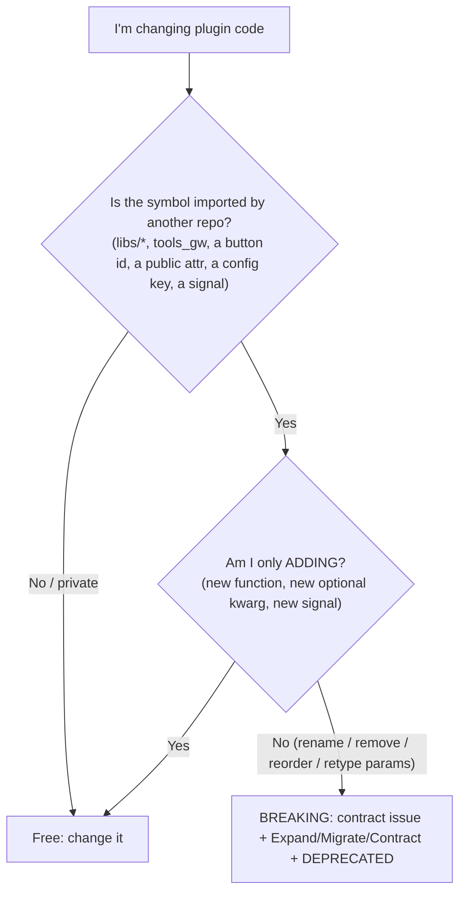

# Giswater plugin breaking-changes guide (cookbook)

Case-by-case "what to do exactly" for changes to the **QGIS plugin's own public surface** — the Python/Qt API
that other Giswater plugins and shared code import and depend on.

This is the client-side twin of the DB cookbook. For the **database** contract see
[dbmodel/BREAKING-CHANGES-GUIDE.md](dbmodel/BREAKING-CHANGES-GUIDE.md) and [dbmodel/MAINTENANCE.md](dbmodel/MAINTENANCE.md).

The plugin wears **two hats**:

1. **Tier-1 DB client** — it locks to the DB epoch (plugin major `4` ↔ DB epoch `4`); it breaks/migrates when the *DB* changes shape. That direction is covered by the DB guide.
2. **Upstream library** — other Giswater plugins import its modules. Breaking *that* surface is what **this** guide is about.

---

## Versioning

- **`version` in `metadata.txt`** (currently `4.14.0`) is the plugin's semver.
- **Major locks to the DB epoch:** plugin `4.x` ⇒ DB `4.x`. The plugin bumps to `5.0` only in the DB major-release train.
- **Minor / patch are the plugin's own cadence** (they do *not* equal the DB minor).
- Within plugin major `4.x`, the public surface is **additive only**. Renames/removals wait for plugin `5.0`.

Any consumer pins, at load time:

- `GISWATER_PLUGIN_SUPPORTED_MAJOR` (= `4`) — refuse a plugin from another major.
- `GISWATER_PLUGIN_MIN_VERSION` — the minimum plugin version it needs.

(Mirror of the tier-1 DB handshake in `core/load_project.py::_check_version_compatibility`, but client→plugin instead of client→DB.)

---

## What is the "public surface"?

Highest stability bar at the top.

| Surface | Where | Notes |
|---------|-------|-------|
| Shared libs | `libs/` — `tools_qt`, `tools_db`, `tools_qgis`, `tools_os`, `tools_log`, `tools_pgdao`, `lib_vars` | Reused by **every** Giswater plugin. Treat as a published library. |
| Core helpers | `core/utils/tools_gw.py`, `core/utils/tools_backend_calls.py` | Giswater-specific helpers consumers call directly. |
| Toolbar buttons | `core/toolbars/**` button classes + their **button id / action index** | `gw_plus_plugin` rewires specific buttons by id. |
| Shared dialogs / widgets | `core/shared/**`, `core/ui/**` object names, `core/models/**` | Public attributes + `.ui` widget `objectName`s are a contract. |
| Globals | `global_vars`, `lib_vars` attributes | Module-level state consumers read. |
| Config / project vars | config keys, project variables (`gwAddSchema`, `gwMainSchema`, …) | Read by consumers and stored in QGIS projects. |
| Qt signals | signals on shared objects / `signal_manager` | Connected by consumers. |

**Not public (change freely):** names with a leading underscore, function-local code, `.ui` internals not referenced by object name, anything no other repo imports.

---

## Deprecation convention (Python)

Same `DEPRECATED #<issue>` token as SQL, so one `rg "DEPRECATED #"` across the whole monorepo lists everything to remove at the next major.

```python
import warnings

def old_name(*args, **kwargs):  # DEPRECATED #<issue> use new_name
    warnings.warn(
        "old_name() is deprecated, use new_name(); removed in Giswater 5.0",
        DeprecationWarning,
        stacklevel=2,
    )
    return new_name(*args, **kwargs)
```

- Keep the old symbol working until the major.
- Tag it `# DEPRECATED #<issue>`.
- Note it in `CHANGELOG.md` with the issue number.
- Link the issue to the open major-release epic.

---

## Is my change breaking?



---

## Quick index

| Case | Breaking? | Recipe |
|------|-----------|--------|
| [1. Add a function or optional parameter](#case-1-add-a-function-or-optional-parameter) | No | additive |
| [2. Rename a public function](#case-2-rename-a-public-function) | Yes | alias + warning |
| [3. Change a function signature](#case-3-change-a-function-signature) | Yes | optional kwarg / new function |
| [4. Move a function between modules](#case-4-move-a-function-between-modules) | Yes | re-export from old module |
| [5. Rename / remove a toolbar button](#case-5-rename--remove-a-toolbar-button) | Yes | keep id, deprecate class |
| [6. Change a shared dialog / widget contract](#case-6-change-a-shared-dialog--widget-contract) | Yes | add new, keep old name |
| [7. Rename / remove a config key or project variable](#case-7-rename--remove-a-config-key-or-project-variable) | Yes | read both, write new |
| [8. Change a Qt signal](#case-8-change-a-qt-signal) | Yes | add new signal, keep old |
| [9. Breaking change forced by a DB epoch bump](#case-9-breaking-change-forced-by-a-db-epoch-bump) | Yes (major) | release train |

Every breaking case follows the same arc: **Expand** (add new, keep old as deprecated) → **Migrate** (update internal callers + tell `gw_plus_plugin`) → **Contract** (remove at plugin `5.0`).

---

## Case 1: Add a function or optional parameter

Additive. New public function, or a **new keyword argument with a default** (never a new positional in the middle).

```python
def get_thing(feature, *, include_geom=False):  # include_geom added with a default
    ...
```

No contract issue. Consumers that don't pass it are unaffected.

---

## Case 2: Rename a public function

**Expand:** create `new_name`; keep `old_name` as a deprecated wrapper (see convention above).

**Migrate:** update all internal callers to `new_name`; notify `gw_plus_plugin` (contract issue checklist).

**Contract (plugin `5.0`):** delete `old_name`.

---

## Case 3: Change a function signature

Never reorder or remove existing positional parameters within a major.

- **Add input:** new keyword arg with a default (Case 1).
- **Remove / repurpose a param, or change return type:** add a **new function** with the new shape; deprecate the old one (Case 2). Don't silently change the meaning of an existing parameter or return value.

```python
def do_x_v2(feature, mode="strict"):  # new shape
    ...

def do_x(feature):  # DEPRECATED #<issue> use do_x_v2
    warnings.warn("do_x() is deprecated, use do_x_v2(); removed in 5.0", DeprecationWarning, stacklevel=2)
    return do_x_v2(feature)
```

---

## Case 4: Move a function between modules

Imports like `from core.utils.tools_gw import foo` are part of the contract.

**Expand:** move the implementation; **re-export** from the old location.

```python
# core/utils/tools_gw.py
from core.utils.new_module import foo  # DEPRECATED #<issue> re-export; import from new_module
```

**Migrate:** update internal imports to the new module.

**Contract (plugin `5.0`):** remove the re-export.

---

## Case 5: Rename / remove a toolbar button

`gw_plus_plugin` rewires specific buttons **by id/action index**, so the id is the contract, not the class name.

**Expand:**
- Keep the existing **button id / action index** stable.
- If renaming the class, keep an alias (Case 2) or keep the old module path (Case 4).
- If a button is going away, keep it registered but mark it deprecated; tag `# DEPRECATED #<issue>`.

**Migrate:** coordinate with `gw_plus_plugin` if it overrides that button.

**Contract (plugin `5.0`):** remove the button id + class.

> Reusing an existing button id for a *different* action is itself a breaking change — allocate a new id instead.

---

## Case 6: Change a shared dialog / widget contract

Public attributes of shared dialog classes and `objectName`s of widgets in `.ui` files (looked up via `tools_qt`) are a contract.

**Expand:** add the new widget/attribute; keep the old `objectName`/attribute in place.

**Migrate:** move internal lookups to the new name.

**Contract (plugin `5.0`):** remove the old `objectName`/attribute.

Don't reorder or retype an existing public attribute within a major.

---

## Case 7: Rename / remove a config key or project variable

Config keys and QGIS project variables (`gwAddSchema`, `gwMainSchema`, `gwProjectType`, …) live in users' projects/config files.

**Expand:** read the **new** key, fall back to the **old** one; write only the new.

```python
value = get_config("new_key")  # DEPRECATED #<issue> remove old_key fallback at 5.0
if value is None:
    value = get_config("old_key")
```

**Migrate:** writers emit only `new_key`; a one-time migration may copy old → new.

**Contract (plugin `5.0`):** drop the `old_key` fallback.

---

## Case 8: Change a Qt signal

Consumers connect slots to signals; renaming or changing the argument list breaks them silently.

**Expand:** add the **new** signal; keep emitting the **old** one too.

```python
old_changed = pyqtSignal(int)        # DEPRECATED #<issue>
changed = pyqtSignal(int, str)       # new

def _emit(self, a, b):
    self.changed.emit(a, b)
    self.old_changed.emit(a)         # keep old subscribers working
```

**Migrate:** internal connections move to the new signal.

**Contract (plugin `5.0`):** remove the old signal and its emit.

---

## Case 9: Breaking change forced by a DB epoch bump

When the DB goes to `5.0`, the plugin bumps to `5.0` in the same release train:

1. Bump `version` in `metadata.txt` to `5.0.0`.
2. Update `_check_version_compatibility` to require DB epoch `5`.
3. Drop reads of old DB shapes (the DB's `DEPRECATED` surfaces are gone).
4. Do all the plugin's own `5.0` contractions at the same time: `rg "DEPRECATED #"` in this repo, remove deprecated aliases/signals/keys.
5. Link everything to the DB major-release epic.

`gw_plus_plugin` then bumps its supported plugin major to `5` and follows.

---

## After any breaking change

- [ ] `[CONTRACT]` issue opened (use the DB repo template style)
- [ ] `# DEPRECATED #<issue>` on every removable symbol; old symbol still works
- [ ] `DeprecationWarning` emitted from deprecated wrappers
- [ ] Internal callers migrated to the new surface
- [ ] `gw_plus_plugin` (and other known consumers) notified / issue linked
- [ ] `CHANGELOG.md` entry with the issue number
- [ ] Linked to the open major-release epic for removal at plugin `5.0`

---

## See also

- [dbmodel/BREAKING-CHANGES-GUIDE.md](dbmodel/BREAKING-CHANGES-GUIDE.md) — DB-side recipes (the plugin as a tier-1 DB client).
- [dbmodel/MAINTENANCE.md](dbmodel/MAINTENANCE.md) — epoch, schema classes, tier-1/tier-2 handshake, PR checklists.
- `CONTRIBUTING.md` — plugin contribution workflow.
- `core/load_project.py` — `_check_version_compatibility()` (the DB handshake to mirror for plugin consumers).
