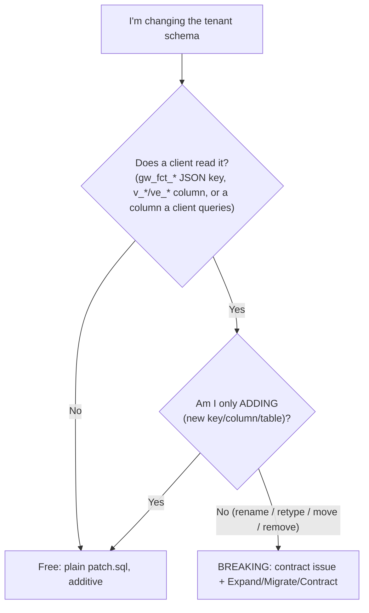

# Giswater DB breaking-changes guide (cookbook)

Case-by-case "what to do exactly" for changes to the Giswater **tenant** schema (Class A: `ws` / `ud`,
the `gw_fct_*` JSON and `v_*` / `ve_*` views that clients read).

Read [MAINTENANCE.md](MAINTENANCE.md) first for the **rules** (epoch, the two rules, schema classes, handshake).
This file is the **recipes**. For API-owned schemas (Class B) and the shared `log` schema (Class C) see MAINTENANCE.md — they do not use this cookbook.

---

## Is my change breaking?



**Free (additive, no contract issue):** new table, new column, new index, new key in a JSON response, new column appended to a view.

**Breaking (needs a `[CONTRACT]` issue + `DEPRECATED #<issue>`):** rename, retype, move, or remove anything a client reads.

Every breaking change follows the same arc — **Expand** (4.x patch, add new + keep old + downgrade), **Migrate** (clients move), **Contract** (next major removes old). The recipes below give the exact SQL per case.

---

## Quick index

| Case | Breaking? | Recipe |
|------|-----------|--------|
| [1. Add a column to a table](#case-1-add-a-column-to-a-table) | No | additive |
| [2. Add a key to a `gw_fct_*` response](#case-2-add-a-key-to-a-gw_fct_-response) | No | additive |
| [3. Add a column to a view](#case-3-add-a-column-to-a-view) | No | additive |
| [4. Rename a column read by clients](#case-4-rename-a-column-read-by-clients) | Yes | expand + sync + contract |
| [5. Retype a column (e.g. varchar `id` -> int)](#case-5-retype-a-column) | Yes | expand + sync trigger + contract |
| [6. Move / rename a key in a `gw_fct_*` response](#case-6-move--rename-a-key-in-a-gw_fct_-response) | Yes | expand + downgrade transform + contract |
| [7. Rename / retype a view column](#case-7-rename--retype-a-view-column) | Yes | expand column + contract |
| [8. Remove a function / table / view / column](#case-8-remove-a-function--table--view--column) | Yes | deprecate now, remove at major |
| [9. Change a function's input contract](#case-9-change-a-functions-input-contract) | Yes | accept both + contract |
| [10. Drop a view without cascade](#case-10-drop-a-view-without-cascade) | Special | documented DROP |

---

## Case 1: Add a column to a table

Additive. Use the admin helper so catalogs/permissions stay consistent.

```sql
-- updates/M/m/p/patch.sql  (correct scope: common | ws | ud)
SELECT gw_fct_admin_manage_fields($${"data":{"action":"ADD","table":"plan_psector","column":"archived","dataType":"boolean"}}$$);
```

No contract issue. Add a `changelog.txt` bullet with the issue number.

---

## Case 2: Add a key to a `gw_fct_*` response

Additive — clients ignore unknown keys (Pydantic models allow extra/optional). Just emit the key.
If a client *needs* it, that client bumps its own min DB version and notes it in its CHANGELOG. No contract issue.

---

## Case 3: Add a column to a view

Additive. Append the column; never reorder/rename existing ones.

```sql
-- updates/M/m/p/patch.sql
CREATE OR REPLACE VIEW v_edit_node AS
SELECT ...,            -- existing columns unchanged, same order
       n.new_column;   -- appended
```

No contract issue.

---

## Case 4: Rename a column read by clients

Breaking. Keep both names during the major; sync them; drop the old at the next major.

**Expand (4.x patch):**

```sql
-- Add the new column
SELECT gw_fct_admin_manage_fields($${"data":{"action":"ADD","table":"foo","column":"new_name","dataType":"text"}}$$);

-- Backfill + keep in sync (trigger or generated column). DEPRECATED #<issue> on the OLD one.
UPDATE foo SET new_name = old_name WHERE new_name IS DISTINCT FROM old_name;
-- old_name kept; tag it:
COMMENT ON COLUMN foo.old_name IS 'DEPRECATED #<issue> use new_name';
UPDATE audit_cat_table SET isdeprecated = TRUE WHERE ...;  -- if the whole relation is going away
```

Expose `new_name` in the relevant `v_*` / `ve_*` view (append, keep `old_name` for now).

**Migrate:** plugin / giswater-api / qwc2 read `new_name`.

**Contract (`5/0/x` at major):** drop `old_name`, its sync trigger, and the comment.

---

## Case 5: Retype a column

Example: `doc.id` varchar -> integer. **Never retype in place during a major** (it breaks every reader and FK).

**Expand (4.x patch):** add a parallel typed column + a sync trigger so both stay populated.

```sql
SELECT gw_fct_admin_manage_fields($${"data":{"action":"ADD","table":"doc","column":"id_int","dataType":"integer"}}$$);

-- one-time backfill
UPDATE doc SET id_int = id::integer WHERE id ~ '^\d+$';

-- keep in sync both ways during the migration window  -- DEPRECATED #<issue> (remove trigger at major)
CREATE OR REPLACE FUNCTION gw_trg_doc_id_sync() RETURNS trigger AS $$
BEGIN
  IF NEW.id_int IS NULL AND NEW.id ~ '^\d+$' THEN NEW.id_int := NEW.id::integer; END IF;
  IF NEW.id IS NULL AND NEW.id_int IS NOT NULL THEN NEW.id := NEW.id_int::text; END IF;
  RETURN NEW;
END; $$ LANGUAGE plpgsql;

DROP TRIGGER IF EXISTS trg_doc_id_sync ON doc CASCADE;
CREATE TRIGGER trg_doc_id_sync BEFORE INSERT OR UPDATE ON doc FOR EACH ROW EXECUTE FUNCTION gw_trg_doc_id_sync();
```

Views expose `id_int` alongside `id`.

**Migrate:** clients move to `id_int` over a minor.

**Contract (major):** drop varchar `id`, drop the sync trigger/function, `ALTER TABLE doc RENAME COLUMN id_int TO id`.

> Anti-pattern: the historical in-place `DROP VIEW` + retype done in a minor. Under these rules that is a major-only operation.

---

## Case 6: Move / rename a key in a `gw_fct_*` response

This is the canonical case (e.g. getselectors moving fields from `body.form.formTabs[].fields` to a flat `body.data.fields`).
The DB emits the **new** shape and **downgrades** for older clients. Clients carry no version-ifs.

**Expand (4.x patch):**

1. Build the response in the **new** shape inside the function.
2. Add a **downgrade transform** keyed on `client.version` (see [Writing a downgrade transform](#writing-a-downgrade-transform)).
3. Tag the transform and any leftover old-shape code `-- DEPRECATED #<issue>`.

**Migrate:** clients read the new shape (`body.data.fields` by `tabname`).

**Contract (major):** delete the downgrade transform and any old-shape branch.

---

## Case 7: Rename / retype a view column

Views are a stable contract. You cannot rename/retype a column in place within a major (readers break).

**Expand:** `CREATE OR REPLACE VIEW` adding the **new** column (append); keep the old column. Tag the old one in `changelog.txt` with `DEPRECATED #<issue>` (views have no per-column COMMENT lifecycle, so the changelog + issue is the paper trail).

**Migrate:** clients read the new column.

**Contract (major):** `CREATE OR REPLACE VIEW` without the old column.

---

## Case 8: Remove a function / table / view / column

Never remove within a major. Deprecate now, remove at the major.

**Expand (4.x patch):**

```sql
-- mark in the catalog so lastprocess / new projects can skip it
UPDATE audit_cat_function SET isdeprecated = TRUE WHERE function_name = 'gw_fct_old';
UPDATE audit_cat_table    SET isdeprecated = TRUE WHERE table_name    = 'old_table';
UPDATE audit_cat_sequence SET isdeprecated = TRUE WHERE ...;
```

Tag the definition `-- DEPRECATED #<issue>` so `rg "DEPRECATED #"` finds it.
`DROP` is **forbidden** in a patch (see `info.txt`).

**Contract (major):** drop the relation/function in `5/0/x/patch.sql`.

---

## Case 9: Change a function's input contract

If you must change what a client **sends** (params in the request body): make the function **accept both** old and new during the major.

**Expand:** read the new param if present, else fall back to the old; tag the fallback `-- DEPRECATED #<issue>`.

```sql
v_value := COALESCE(p_data->'data'->>'new_param', p_data->'data'->>'old_param');  -- DEPRECATED #<issue>
```

**Migrate:** clients send the new param.

**Contract (major):** drop the fallback; require the new param.

---

## Case 10: Drop a view without cascade

Sometimes a view must actually be dropped (not replaceable). `DROP CASCADE` is **forbidden**.

```sql
DROP VIEW IF EXISTS v_old_view;   -- document this explicitly in changelog.txt (special case)
```

If anything depends on it, that dependency must be handled in the same patch (recreate dependents), or defer to the next major.

---

## Writing a downgrade transform

All response JSON funnels through `gw_fct_json_create_return`. That is the single place backward compatibility lives.

**1. Capture the caller version** near the top of the top-level `gw_fct_*` (or once in the chokepoint):

```sql
PERFORM set_config('giswater.client_version', COALESCE(p_data->'client'->>'version', ''), true);
```

**2. Register the transform.** Prefer a table so non-SQL devs can audit one row per change:

```sql
CREATE TABLE IF NOT EXISTS config_contract_downgrade (
  id           serial PRIMARY KEY,
  fnumber      text NOT NULL,        -- function this applies to, e.g. 'gw_fct_getselectors'
  introduced_in text NOT NULL,       -- new shape shipped in this Giswater version, e.g. '4.9.0'
  transform_fn text NOT NULL,        -- gw_fct_downgrade_* to call
  issue        text                  -- DEPRECATED #<issue>
);
```

**3. Apply in `gw_fct_json_create_return`:** for the called `fnumber`, if `client_version < introduced_in`, run `transform_fn(payload, client_version)` before returning.

**4. Write the transform function** — it rewrites the new shape into the old one. Example for Case 6 (getselectors):

```sql
-- DEPRECATED #<issue>
CREATE OR REPLACE FUNCTION gw_fct_downgrade_getselectors(p_payload json, p_client_version text)
RETURNS json AS $$
BEGIN
  -- nest body.data.fields back under body.form.formTabs[].fields for old clients
  RETURN ...;
END; $$ LANGUAGE plpgsql;
```

**5. Tag** the row, the transform function, and any old-shape branch with `-- DEPRECATED #<issue>`.

**6. Remove** at the next major together with the surface it supported.

---

## After any breaking change

- [ ] `[CONTRACT]` issue opened (template `4-contract-change`)
- [ ] `DEPRECATED #<issue>` on every removable line + `audit_cat_* isdeprecated` where relevant
- [ ] Downgrade transform added if the shape changed for older `client.version`
- [ ] `changelog.txt` bullet with the issue number, correct scope
- [ ] giswater-api model + `dbmodel/contracts/schemas/` updated; contract test + golden snapshot pass
- [ ] Linked from the open major-release epic (template `5-major-release-epic`) for eventual removal

---

## See also

- [MAINTENANCE.md](MAINTENANCE.md) — rules, epoch, schema classes, handshake, PR checklists.
- `info.txt` — folder layout, patch rules, update order, changelog format, conflict-prevention rules.
- `../BREAKING-CHANGES-GUIDE.md` — the same idea for the QGIS plugin's own public surface.
