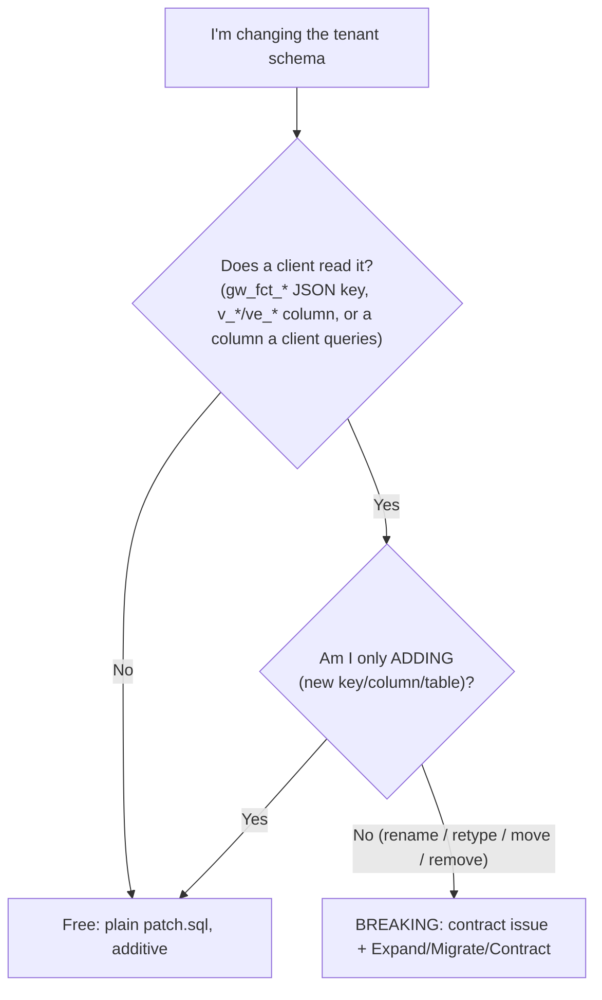

# Giswater DB breaking-changes guide (cookbook)

Case-by-case "what to do exactly" for changes to the Giswater **tenant** schema (Class A: `ws` / `ud`,
the `gw_fct_`* JSON and `v_*` / `ve_*` views that clients read).

Read [MAINTENANCE.md](MAINTENANCE.md) first for the **rules** (epoch, the two rules, schema classes, handshake).
This file is the **recipes**. For API-owned schemas (Class B) and the shared `log` schema (Class C) see MAINTENANCE.md — they do not use this cookbook.

---

## Is my change breaking?




**Free (additive, no contract issue):** new table, new column, new index, new key in a JSON response, new column appended to a view.

**Breaking (needs a `[CONTRACT]` issue + `DEPRECATED #<issue>`):** rename, retype, move, or remove anything a client reads.

Every breaking change follows the same arc — **Expand** (4.x patch, add new + keep old), **Migrate** (clients move), **Contract** (next major removes old). The recipes below give the exact SQL per case.

---

## Quick index


| Case                                                                                                | Breaking? | Recipe                                                                     |
| --------------------------------------------------------------------------------------------------- | --------- | -------------------------------------------------------------------------- |
| [1. Add a column to a table](#case-1-add-a-column-to-a-table)                                       | No        | additive                                                                   |
| [2. Add a key to a `gw_fct_`* response](#case-2-add-a-key-to-a-gw_fct_-response)                    | No        | additive                                                                   |
| [3. Add a column to a view](#case-3-add-a-column-to-a-view)                                         | No        | additive                                                                   |
| [4. Rename a column read by clients](#case-4-rename-a-column-read-by-clients)                       | Yes       | [sync trigger template](#template--same-type-rename-one-trigger-per-table) |
| [5. Retype a column (e.g. varchar `id` -> int)](#case-5-retype-a-column)                            | Yes       | major only — no sync workaround                                            |
| [6. Move / rename a key in a `gw_fct_*` response](#case-6-move--rename-a-key-in-a-gw_fct_-response) | Yes       | dual-emit old + new shape                                                  |
| [7. Rename / retype a view column](#case-7-rename--retype-a-view-column)                            | Yes       | expand column + contract                                                   |
| [8. Remove a function / table / view / column](#case-8-remove-a-function--table--view--column)      | Yes       | deprecate now, remove at major                                             |
| [9. Change a function's input contract](#case-9-change-a-functions-input-contract)                  | Yes       | accept both + contract                                                     |


---

## Case 1: Add a column to a table

Additive. Add the column with a plain `ALTER TABLE` in the patch.

```sql
-- updates/M/m/p/patch.sql  (correct scope: common | ws | ud)
ALTER TABLE plan_psector ADD COLUMN archived boolean;
```

No contract issue. Add a `changelog.txt` that describes the change.

---

## Case 2: Add a key to a `gw_fct_*` response

Additive — clients automatically ignore unknown keys (e.g., Pydantic models permit extra or optional fields). Simply include the new key in the response. 

If a client requires the new key, the client should increase its minimum supported DB version and document the dependency in its CHANGELOG. No contract issue required.

---

## Case 3: Add a column to a view

Additive. You may append new columns at the end of the view—this is considered safe and non-breaking.  
**However, reordering existing columns or renaming columns in a view is always a breaking change**, because clients may rely on both the order and names of columns in queries or inserts.

```sql
-- updates/M/m/p/patch.sql
CREATE OR REPLACE VIEW ve_node AS
SELECT ...,            -- existing columns unchanged, same order
       n.new_column;   -- appended at the end
```

Appending at the end is safe and requires no contract issue.  
**If you need to reorder or rename a column, this is a breaking change and you must follow the breaking change process.**

---

## Case 4: Rename a column read by clients

Breaking. Keep both names during the major; sync them; drop the old at the next major.

Use [Writing a column sync trigger](#writing-a-column-sync-trigger) (same-type rename template).

**Expand (4.x patch):** add column, backfill, attach sync trigger, tag old column with `COMMENT ON COLUMN ... DEPRECATED #<issue>`.

Expose `new_name` in the relevant `v_*` / `ve_*` view (append, keep `old_name` for now).

**Migrate:** plugin / giswater-api / qwc2 read `new_name`.

**Contract (`5/0/x` at major):** drop old columns, `trg_<table>_deprecated_cols_sync`, `gw_trg_<table>_deprecated_cols_sync()`, and comments.

---

## Case 5: Retype a column

**Always breaking.** There is no expand-and-sync workaround like Case 4.

While the old column still exists, both columns would need to stay synchronized bidirectionally. That is **not feasible** for most type changes:

- `**text` → `numeric`**: text accepts any string; not every value casts to numeric, so the new column cannot mirror the old one.
- `**int2` → `int4**`: a value that fits in `int4` may overflow `int2`, so writes to the new column cannot always be reflected back into the old one.
- `**varchar` → `integer**`: same problem — legacy clients keep writing non-numeric text.

❌ **Do not do this in a minor/patch:**

```sql
ALTER TABLE asset ALTER COLUMN diameter TYPE numeric;
```

❌ **Also do not do this** — a parallel column + sync trigger does not fix it:

```sql
ALTER TABLE asset ADD COLUMN diameter_numeric numeric;
-- trigger cannot keep both columns equal for all writes
```

✅ **Only valid approach:**

1. Open a `[CONTRACT]` issue; assign removal/retype to the **next major** milestone.
2. Migrate **all** consumers to read/write through a view or function that exposes the **future** type (or a new column they control), without relying on the physical retype happening yet.
3. Apply the in-place retype **only at the major** (`5/0/x`), when breaking changes are allowed.

```sql
-- 5/0/x/patch.sql only
ALTER TABLE asset ALTER COLUMN diameter TYPE numeric USING diameter::numeric;
```

> Anti-pattern: `DROP VIEW` + in-place retype in a minor. Under these rules that is major-only.

---

## Writing a column sync trigger

For **Case 4 only** (same-type rename). Do **not** use for retypes — see [Case 5](#case-5-retype-a-column).

Bidirectional sync keeps **old** and **new** columns equal while clients migrate. Whichever column a client writes, the trigger copies the value to the other. This works because both columns have the **same type** and accept the same values.

**One trigger + function per table.** Add one INSERT/UPDATE block per renamed pair; extend the existing function if the table already has one from a prior patch.

BEFORE trigger mutating `NEW` does **not** re-fire itself — no recursion guard needed.

On `UPDATE`, sync only when **one** side changed (detect with `IS DISTINCT FROM OLD`). If both changed in the same statement, leave as-is.

On `INSERT`, fill the NULL side; if both are set and differ, prefer the **new** column.

---

### Template — same-type rename (one trigger per table)

Copy into `updates/M/m/p/patch.sql`. Repeat the marked blocks for each renamed pair on the same table.

```sql
-- DEPRECATED #<issue>; remove at major <M>.0.0
-- Pair: foo.old_name -> foo.new_name

ALTER TABLE foo ADD COLUMN new_name text;
UPDATE foo SET new_name = old_name WHERE new_name IS DISTINCT FROM old_name;

CREATE OR REPLACE FUNCTION gw_trg_foo_deprecated_cols_sync() RETURNS trigger AS $$
BEGIN
  IF TG_OP = 'INSERT' THEN
    -- >>> pair old_name / new_name  (#<issue>)
    IF NEW.new_name IS NULL THEN
      NEW.new_name := NEW.old_name;
    ELSIF NEW.old_name IS NULL THEN
      NEW.old_name := NEW.new_name;
    ELSIF NEW.new_name IS DISTINCT FROM NEW.old_name THEN
      NEW.old_name := NEW.new_name;
    END IF;
    -- <<< end pair
    -- >>> next pair old_foo / new_foo  (#<issue2>)  -- duplicate block per pair
    -- <<< end pair
  ELSIF TG_OP = 'UPDATE' THEN
    -- >>> pair old_name / new_name
    IF NEW.new_name IS DISTINCT FROM OLD.new_name THEN
      NEW.old_name := NEW.new_name;
    ELSIF NEW.old_name IS DISTINCT FROM OLD.old_name THEN
      NEW.new_name := NEW.old_name;
    END IF;
    -- <<< end pair
  END IF;
  RETURN NEW;
END;
$$ LANGUAGE plpgsql;

DROP TRIGGER IF EXISTS trg_foo_deprecated_cols_sync ON foo CASCADE;
CREATE TRIGGER trg_foo_deprecated_cols_sync
  BEFORE INSERT OR UPDATE OF old_name, new_name  -- list every old/new pair
  ON foo FOR EACH ROW EXECUTE FUNCTION gw_trg_foo_deprecated_cols_sync();

COMMENT ON COLUMN foo.old_name IS 'DEPRECATED #<issue> use new_name';
```

If the table already has `gw_trg_<table>_deprecated_cols_sync()` from a previous patch, **extend** the existing function (add another pair block) and `CREATE OR REPLACE` the trigger with the expanded `UPDATE OF` column list — do not add a second trigger for the same table.

---

### Contract cleanup (major `5/0/x/patch.sql`)

```sql
DROP TRIGGER IF EXISTS trg_foo_deprecated_cols_sync ON foo CASCADE;
DROP FUNCTION IF EXISTS gw_trg_foo_deprecated_cols_sync();
ALTER TABLE foo DROP COLUMN old_name;  -- repeat per deprecated column
-- RENAME new_name TO final_name if the new name was temporary
```

---

## Case 6: Move / rename a key in a `gw_fct_*` response

Breaking. Old clients read a fixed JSON path — you cannot move or remove it within a major.

**Expand (4.x patch):** emit **both** shapes in the same response. Build the new path and **keep filling the old path** until the major.

```sql
-- new shape
v_body := json_build_object(
  'data', json_build_object('fields', v_fields_new)
);

-- DEPRECATED #<issue>; remove at major
v_body := v_body || json_build_object(
  'form', json_build_object('formTabs', v_form_tabs_old_shape)
);

RETURN gw_fct_json_create_return(json_build_object('body', v_body, ...));
```

For a renamed key at the same level, include both keys with the same value. Tag every branch that builds the old shape `-- DEPRECATED #<issue>`.

No `client.version` checks in the DB. Compatibility = both surfaces alive in the payload.

**Migrate:** plugin / giswater-api / qwc2 read the new path.

**Contract (major):** delete the old-shape branch; response carries only the new path.

---

## Case 7: Rename / retype a view column

Views are a stable contract. You cannot rename/retype a column in place within a major (readers break).

**Expand:** `CREATE OR REPLACE VIEW` adding the **new** column (append); keep the old column. Tag the old one in `changelog.txt` with `DEPRECATED #<issue>` (views have no per-column COMMENT lifecycle, so the changelog + issue is the paper trail).

**Migrate:** clients read the new column.

**Contract (major):** `CREATE OR REPLACE VIEW` without the old column.

---

## Case 8: Remove a function / table / view / column

Never remove within a major. Deprecate now, remove at the major.

**Expand (4.x patch):**

```sql
-- mark in the catalog so lastprocess / new projects can skip it
UPDATE audit_cat_function SET isdeprecated = TRUE WHERE function_name = 'gw_fct_old';
UPDATE audit_cat_table    SET isdeprecated = TRUE WHERE table_name    = 'old_table';
UPDATE audit_cat_sequence SET isdeprecated = TRUE WHERE ...;
```

Tag the definition `-- DEPRECATED #<issue>` so `rg "DEPRECATED #"` finds it.
`DROP` is **forbidden** in a patch (see `info.txt`). Never `DROP CASCADE` — handle dependents explicitly in the same patch, or defer to the major.

**Contract (major):** drop the relation/function in `5/0/x/patch.sql`.

---

## Case 9: Change a function's input contract

If you must change what a client **sends** (params in the request body): make the function **accept both** old and new during the major.

**Expand:** read the new param if present, else fall back to the old; tag the fallback `-- DEPRECATED #<issue>`.

```sql
v_value := COALESCE(p_data->'data'->>'new_param', p_data->'data'->>'old_param');  -- DEPRECATED #<issue>
```

**Migrate:** clients send the new param.

**Contract (major):** drop the fallback; require the new param.

---

## After any breaking change

- [ ] `[CONTRACT]` issue opened (template `4-contract-change`)
- [ ] `DEPRECATED #<issue>` on every removable line + `audit_cat_* isdeprecated` where relevant
- [ ] Old JSON path / column still populated during expand if clients read it
- [ ] `changelog.txt` bullet with the issue number, correct scope
- [ ] giswater-api model + `dbmodel/contracts/schemas/` updated; contract test + golden snapshot pass
- [ ] Linked from the open major-release epic (template `5-major-release-epic`) for eventual removal

---

## See also

- [MAINTENANCE.md](MAINTENANCE.md) — rules, epoch, schema classes, handshake, PR checklists.
- `info.txt` — folder layout, patch rules, update order, changelog format, conflict-prevention rules.
- `../BREAKING-CHANGES-GUIDE.md` — the same idea for the QGIS plugin's own public surface.

