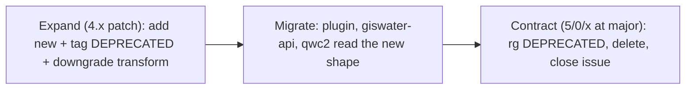

# Giswater DB maintenance & contract guide

How to evolve the Giswater database without breaking its clients (QGIS plugin, giswater-api, qwc2)
and how downstream services (giswater-plus-api, hengine-api, …) hang off the same rules.

**One-liner:** *DB is newest within the epoch; tier-1 clients and DB majors move together; update your schema if it's older than the client.*

---

## Cheat sheet — "I changed X, what do I do?"

This table classifies the change. For the **exact SQL steps per case**, see the cookbook:
[BREAKING-CHANGES-GUIDE.md](BREAKING-CHANGES-GUIDE.md).

| I want to… | Classification | Contract issue? | Recipe |
|------------|----------------|-----------------|--------|
| Add a column / table / index | additive | No | [Case 1](BREAKING-CHANGES-GUIDE.md#case-1-add-a-column-to-a-table) |
| Add a key to a `gw_fct_*` JSON response | additive | No | [Case 2](BREAKING-CHANGES-GUIDE.md#case-2-add-a-key-to-a-gw_fct_-response) |
| Add a column to a `v_*` / `ve_*` view | additive | No | [Case 3](BREAKING-CHANGES-GUIDE.md#case-3-add-a-column-to-a-view) |
| Rename a column clients read | breaking | **Yes** | [Case 4](BREAKING-CHANGES-GUIDE.md#case-4-rename-a-column-read-by-clients) |
| Retype a column | breaking | **Yes** | [Case 5](BREAKING-CHANGES-GUIDE.md#case-5-retype-a-column) |
| Move / rename a key in a `gw_fct_*` response | breaking | **Yes** | [Case 6](BREAKING-CHANGES-GUIDE.md#case-6-move--rename-a-key-in-a-gw_fct_-response) |
| Rename / retype a view column | breaking | **Yes** | [Case 7](BREAKING-CHANGES-GUIDE.md#case-7-rename--retype-a-view-column) |
| Remove a function / table / view / column | breaking | **Yes** | [Case 8](BREAKING-CHANGES-GUIDE.md#case-8-remove-a-function--table--view--column) |
| Change what clients send to a function | breaking | **Yes** | [Case 9](BREAKING-CHANGES-GUIDE.md#case-9-change-a-functions-input-contract) |
| Bump the DB major | release train | Epic | [Major-release workflow](#major-release-workflow-lockstep) |

When in doubt: **additive within the major is free; anything that breaks a reader needs a contract issue.**

---

## The two rules

**Rule 1 — Semver within the epoch.** Within a DB major (all `4.x.y`), changes are **additive only**.
Breaking removals happen **only** at the next DB major, and every tier-1 client bumps major in the same release train.

**Rule 2 — The DB speaks every client dialect.** Backward compatibility for older response shapes lives **in the DB**
(`gw_fct_json_create_return` downgrade transforms keyed on `client.version`). Tier-1 clients carry **no version-ifs**.

---

## Compatibility epoch (anchor = DB major)

`sys_version.giswater` (inside each tenant project schema) defines the **epoch**. Everything tier-1 locks to it.

| Epoch (DB major) | Database | QGIS plugin (this repo) | giswater-api | qwc2 (private) |
|------------------|----------|-------------------------|--------------|----------------|
| **4** (current) | `4.x.y` | `4.x.y` (same number as DB) | `1.x.y` | own semver, e.g. `3.x.y` |
| **5** (future) | `5.0.0` | `5.0.0` | `2.0.0` | next major |

- **Plugin ↔ DB:** tightest coupling — plugin version *is* the Giswater version (`metadata.txt` tracks DB `4.x.y`).
- **giswater-api ↔ DB:** calls `gw_fct_*`, Pydantic validates the JSON. API `1.x` **means** DB epoch 4.
- **qwc2 ↔ DB:** same tier-1 rules, own semver line, same epoch lock.

### Tier-1 handshake (at project load / `/ready`)

Every tier-1 client enforces **both**:

1. `major(db) == supported_db_major` (epoch lock — refuse a DB from another major).
2. `db >= client_min_db` (the schema must be at least as new as the client expects; if older, tell the user to **update the schema**).

| Client | `supported_db_major` | `client_min_db` | `client.version` sent in `gw_fct_*` |
|--------|----------------------|-----------------|-------------------------------------|
| QGIS plugin | `major(plugin)` | plugin version | plugin Giswater version (e.g. `4.8.1`) |
| giswater-api | `GISWATER_DB_SUPPORTED_MAJOR` (=`4`) | `GISWATER_DB_MIN_VERSION` | `GISWATER_CLIENT_VERSION` (Giswater semver — **not** the API's `1.3.2`) |
| qwc2 | env / package constant | env / package constant | same pattern as plugin |

**Three numbers, three roles — don't conflate them:**

- tenant `4.8.1` → **Giswater contract** (epoch + min check)
- giswater-api `1.3.2` → **HTTP/process release** (used by tier-2 peers)
- schema revision `7` → **per-API domain DDL** (see Class B below)

---

## Three schema classes (version is per-schema, not database-wide)

There is no single "database version". Each schema is versioned by what owns it.

| Class | Examples | Who owns DDL | Version source | Handshake |
|-------|----------|--------------|----------------|-----------|
| **A — Giswater tenant** | per-project `ws` / `ud` | dbmodel patches (`updates/M/m/p/patch.sql`) | `{tenant}.sys_version.giswater` | tier-1: epoch + `db >= client` |
| **B — API domain** | `hengine.*`, `artifacts.*`, `storage.*` | that API repo: `app/db/migrations/*.sql` + startup runner | `{schema}.schema_migrations.revision` (integer) | `/ready`: `MAX(revision) >= REQUIRED_SCHEMA_REVISION` |
| **C — shared infra** | `log` (HTTP + DB-function logs) | each writer runs only its own `ensure_*` on startup | none — stable tables, additive columns only | startup idempotent DDL; fail loud on SQL error |

### Class A — the Giswater tenant schema

This is the contract this guide is mostly about. Follow `info.txt` for folder layout and the
patch rules below. Clients read it via `gw_fct_*` and `v_*` / `ve_*` views.

### Class B — dedicated API schemas (the standard to adopt)

APIs with real domain tables get their **own Postgres schema** and their **own revision** — which is **not** the API's semver.

```
app/db/
  migrate.py              # apply pending migrations on startup, transactional
  schema_revision.py      # REQUIRED_SCHEMA_REVISION = 7  (what this binary expects)
  migrations/
    0001_init.sql         # CREATE SCHEMA + tables + schema_migrations ledger
    0002_add_jobs.sql     # additive
    0008_add_foo.sql
```

`0001_init.sql` creates the ledger:

```sql
CREATE SCHEMA IF NOT EXISTS hengine;
CREATE TABLE IF NOT EXISTS hengine.schema_migrations (
  revision    integer PRIMARY KEY,
  applied_at  timestamptz NOT NULL DEFAULT now(),
  api_version text          -- pyproject version at apply time (audit only)
);
```

Startup runner: read `MAX(revision)`, apply each `NNNN_*.sql` with `NNNN > applied` in order inside a transaction,
insert the new revision. `/ready` fails if `applied < REQUIRED_SCHEMA_REVISION`.

- A patch release may ship **zero** migrations; a minor may add one. Map it in the API CHANGELOG: *"1.4.0 requires schema revision >= 8."*
- Within an API major, migrations are **additive only**. Breaking DDL → API major bump.
- Don't store only `api_version` in the DB and assume it equals schema state — redeploys/rollbacks break that.
- Reviewable SQL in PRs + ordered history beats embedded idempotent Python for real domain schemas.

### Class C — the shared `log` schema (keep it simple)

Team decision: `log` tables are stable, at most gaining new columns — **no version table**.

1. Each service creates **only its own** tables, prefixed `{service}_*` (`gw_api_logs`, `hengine_logs`, …).
2. Idempotent startup: `CREATE SCHEMA IF NOT EXISTS log`, `CREATE TABLE IF NOT EXISTS …`, `ALTER … ADD COLUMN IF NOT EXISTS …`.
3. Never `DROP` another service's objects.
4. Additive only within an API major; a breaking log redesign means an API major + a new table name.

Do **not** add `log.sys_version` — multiple independent writers can't share one row.

### `/ready` reports each class separately

```json
{
  "checks": {
    "database": "up",
    "giswater_tenant": { "schema": "ws_demo", "version": "4.8.1", "epoch": 4, "ok": true },
    "log_schema": { "ok": true },
    "api_process": { "version": "1.3.2", "ok": true }
  }
}
```

APIs with a Class B schema add e.g. `"hengine_schema": { "revision": 7, "required": 7, "ok": true }`.

---

## Expand → Migrate → Contract

The lifecycle of any breaking change. It spans a full major cycle on purpose.



1. **Expand** — in a `4.x` patch on `main`: add the new surface next to the old one; tag the old one
   `-- DEPRECATED #<issue>`; add a downgrade transform if older clients must keep the old shape.
2. **Migrate** — plugin, giswater-api, qwc2 each move to the new shape in their own PRs, all linked to the one contract issue.
3. **Contract** — only at the next DB major (`5/0/x`): `rg "DEPRECATED #<issue>"`, delete the old surface and its
   downgrade transform, close the issue.

### Deprecation paper trail

- **In SQL:** `-- DEPRECATED #<issue>` on every line/block to be removed at the major. One issue per deprecatable unit.
- **In catalog:** `UPDATE audit_cat_table / audit_cat_function / audit_cat_sequence SET isdeprecated = TRUE`.
- **In changelog:** a bullet with the issue number (mandatory — see `info.txt`).

`rg "DEPRECATED #"` is the single source of truth for "what must we delete at the next major".

---

## Patterns & exact recipes

The conflict-prevention rules (use `gw_fct_admin_manage_fields` for new fields, `CREATE OR REPLACE VIEW`,
`CREATE TABLE IF NOT EXISTS`, `ON CONFLICT … DO NOTHING`, no `DROP` / `DROP CASCADE` within a major) live in `info.txt`.

The **per-case SQL recipes** — rename a column, retype a column, move a JSON key, deprecate/remove, and how to
**write a downgrade transform** for `gw_fct_json_create_return` — live in
[BREAKING-CHANGES-GUIDE.md](BREAKING-CHANGES-GUIDE.md). Don't duplicate them here; link to the relevant case from your PR.

**New-code rule (always):** read through `v_*` / `ve_*` views or `gw_fct_*`, not base tables. Convert opportunistically when you touch nearby code.

---

## Major-release workflow (lockstep)

- **Don't** create `5/0/0` while developing `4.x`. Keep draft major SQL in `dev/` (scratch), never wired to manifests.
- At the **5.0 RC**, create `schemas/main/{common,ws,ud}/updates/5/0/0/patch.sql`; split `5/0/1`, `5/0/2` if large.
- Trunk-based: PR to `main`. No long-lived `major/5.0` branch.
- Open a **major-release epic** (issue template 5) linking every `[CONTRACT]` child issue and every tier-1 client child issue.
- Gate: no tier-1 client ships against DB 5 before its own major; none stays on 4.x after DB 5 GA.

---

## Tier-2+ peer clients (appendix)

Services that depend on **another API** (not the DB directly): giswater-plus-api, gw_plus_plugin, hengine-api,
artifacts-api, storage-api, … Same semver *ideas*, different contract surface (HTTP/OpenAPI, not `gw_fct_*` JSON).

**Rule for every HTTP hop: check the immediate upstream only — never transitive versions.**

| | Tier 1 (→ DB) | Tier 2+ (→ direct peer API) |
|--|---------------|------------------------------|
| Epoch lock | DB major | the peer's major |
| Within major | additive only | additive only (new endpoints/fields; no rename/remove) |
| Breaking change | DB major train | bump **your** major when your **direct** upstream bumps major |
| Startup check | `major(db)` + `db >= min` | `major(peer)` + `peer >= <PEER>_MIN_VERSION` |
| Contract artifact | Pydantic → JSON Schema → dbmodel CI | OpenAPI; the peer repo owns its CI |
| Config naming | `GISWATER_DB_*` | `<PEER>_MIN_VERSION`, `<PEER>_SUPPORTED_MAJOR` |

Example chain:

| Component | Checks at startup | Declares for downstream |
|-----------|-------------------|-------------------------|
| gw_plus_plugin | `GISWATER_PLUS_API_*` **and** base plugin tier-1 DB handshake | — |
| giswater-plus-api | `GISWATER_API_*` (+ optional `HENGINE_API_*`) | `GISWATER_PLUS_API_MIN_VERSION` |
| hengine-api | `GISWATER_API_*` (if it calls giswater) + `ARTIFACTS_API_*` | `HENGINE_API_MIN_VERSION` |
| artifacts-api | `STORAGE_API_*` | `ARTIFACTS_API_MIN_VERSION` |
| storage-api | (storage backend only) | `STORAGE_API_MIN_VERSION` |

`gw_plus_plugin` has **two independent gates**: the plus-api peer check for plus features, and the base
`plugin` tier-1 DB handshake for everything else. Both must pass for plus features to load.

**Out of scope here** (own maintenance docs, not dbmodel CI): FROST / IoT ingest, ts-engine, scada, grafana alerts,
the `twin` model, calibrador, crone internals, the `audit` schema, the `gis` DB beyond ws/ud, and file formats like `.dat`.

---

## PR checklists

**DB / tier-1 PRs**

- [ ] Changelog entry + issue number
- [ ] Contract-bound? → contract issue (template 4) + `DEPRECATED #` tags
- [ ] Additive within the current DB epoch (no rename/remove of a client surface)
- [ ] New code reads `v_*` / `ve_*` / `gw_fct_*`, not base tables
- [ ] giswater-api model + `dbmodel/contracts/schemas/` updated if JSON shape changed
- [ ] `GISWATER_DB_MIN_VERSION` / API CHANGELOG bumped if the change requires a newer DB
- [ ] Contract test / golden snapshot updated if JSON changed
- [ ] Downgrade transform added if the shape changed for older `client.version`
- [ ] No version-ifs in tier-1 client code
- [ ] Major bump? → coordinated epic; all tier-1 majors ship together

**Tier-2+ PRs (giswater-plus-api, hengine-api, artifacts-api, …)**

- [ ] Direct upstream `<PEER>_MIN_VERSION` + `<PEER>_SUPPORTED_MAJOR` in README + env example
- [ ] Startup check on the **direct** peer only (not transitive)
- [ ] Additive within the upstream major; breaking → bump your own major when the upstream major bumps
- [ ] Class B schema change? → new `migrations/NNNN_*.sql` + bump `REQUIRED_SCHEMA_REVISION`

**gw_plus_plugin PRs**

- [ ] Plus-api peer check and base plugin DB check both present
- [ ] No assumption that plus-api replaces the tier-1 handshake for non-plus code paths

---

## See also

- [BREAKING-CHANGES-GUIDE.md](BREAKING-CHANGES-GUIDE.md) — case-by-case SQL recipes for every breaking DB change.
- `info.txt` — SQL folder layout, patch rules, update order, changelog format.
- `README.md` — schema architecture, build manifests, local testing.
- `.github/ISSUE_TEMPLATE/4-contract-change.md` — contract issue checklist.
- `.github/ISSUE_TEMPLATE/5-major-release-epic.md` — major-release epic checklist.
- `../BREAKING-CHANGES-GUIDE.md` — the same idea for the QGIS plugin's own public surface.
